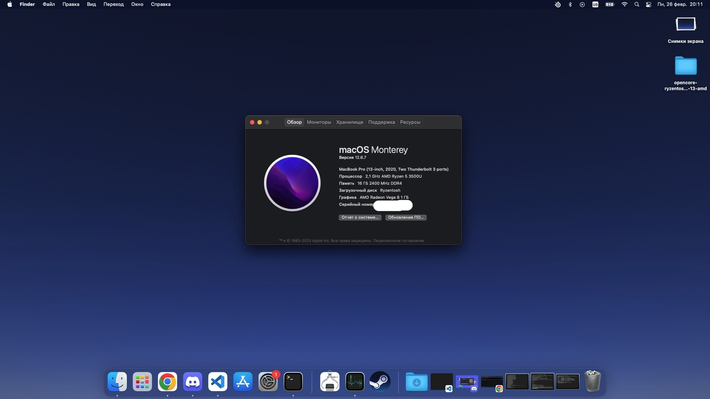

# EFI for Huawei MateBook 13 AMD

# This EFI you use it at your own risk!

OS works - Monterey, Sonoma (with kernel panic - https://github.com/ChefKissInc/NootedRed/issues/186 )

Issue: 
I have an intel ax210, I haven't tried it with the factory wifi adapter

Works:
Sleep,
WIFI and BT.
Factory dongle with HDMI, but need NootedRed.kext

What doesnt work:
WebCamera :)

Any way with latest kext NootedRed, works Photoshop, Krita and etc. But! - Google Chrome have a artefacts.
